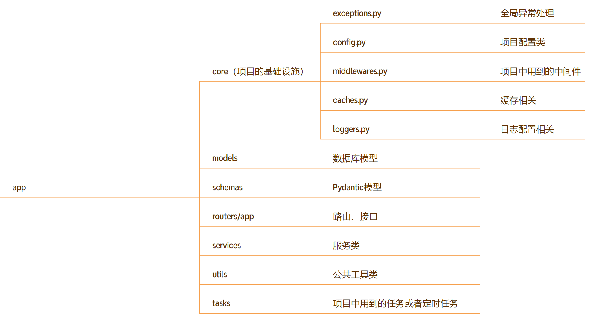

# Fastapi项目

## 1. Fastapi 项目结构

创建新的`Fastapi`项目时，项目的结构大概如下：



```bash
fastapi_project/                   # 项目根目录
│
├── app/                           # 主应用目录（核心代码）
│   ├── __init__.py                # 包标识
│   ├── main.py                    # 应用入口（FastAPI 实例）
│   │
│   ├── core/                      # 核心配置模块
│   │   ├── __init__.py
│   │   ├── config.py             # 配置管理（读取 .env）
│   │   └── deps.py               # 依赖注入（Depends）
│   │
│   ├── models/                    # ORM 数据模型（数据库表）
│   │   ├── __init__.py
│   │   └── auth.py               # 用户模型
│   │
│   ├── schemas/                   # Pydantic 模型（请求/响应验证）
│   │   ├── __init__.py
│   │   └── auth.py               # 用户请求/响应结构
│   │
│   ├── routers/                   # 路由层（API 端点）
│   │   ├── __init__.py
│   │   └── auth.py               # 认证路由（登录/注册）
│   │
│   ├── services/                  # 业务逻辑层
│   │   ├── __init__.py
│   │   └── auth_service.py       # 认证业务逻辑
│   │
│   └── utils/                     # 工具函数
│       ├── __init__.py
│       ├── smtp_util.py          # 邮件发送
│       └── pwd_util.py           # 密码加密
│
├── .env                           # 环境变量（敏感信息，不提交 Git）
├── .env.example                   # 环境变量示例（提交 Git）
├── requirements.txt               # 项目依赖
└── README.md                      # 项目说明
```

### 1.1. `app/core`


### 1.2 `app/models  `ORM 数据模型

`app/models/` 是 FastAPI 项目中**与数据库交互的核心桥梁**，主要有 **3 大作用**：

🎯 三大核心作用

| 作用                 | 说明                                                   | 类比                   |
| :------------------- | :----------------------------------------------------- | :--------------------- |
| **① 定义表结构**     | 用 Python 类描述数据库表有哪些字段、类型、约束         | 建筑图纸（设计表结构） |
| **② ORM 数据库操作** | 提供 `create()`、`filter()`、`update()` 等方法操作数据 | 施工队（增删改查）     |
| **③ 迁移数据源**     | 供 Aerich 读取并生成数据库迁移文件                     | 设计蓝图（指导变更）   |

1️⃣ 定义表结构

```python

# app/models/auth.py
from tortoise import Model, fields

class User(Model):
    """
    定义 users 表的结构
    
    这个类对应数据库中的一张表，每个属性对应一个字段
    """
    
    # ===== 字段定义 =====
    # 主键：自增整数
    id = fields.IntField(pk=True)
    
    # 字符串字段：最大长度 128，唯一索引
    email = fields.CharField(
        max_length=128, 
        unique=True,           # 唯一约束
        db_index=True,         # 创建索引
        null=False,            # 不允许为空
        description="邮箱"      # 字段注释
    )
    
    # 字符串字段：存储加密后的密码
    password = fields.CharField(
        max_length=128,
        null=False,
        description="密码哈希值"
    )
    
    # 布尔字段：默认未删除
    is_deleted = fields.BooleanField(
        default=False,
        description="软删除标记"
    )
    
    # 时间字段：创建时自动填充
    created_at = fields.DatetimeField(
        auto_now_add=True,     # 创建时自动设置
        description="创建时间"
    )
    
    # 时间字段：更新时自动填充
    updated_at = fields.DatetimeField(
        auto_now=True,         # 每次更新时自动设置
        description="更新时间"
    )
    
    class Meta:
        table = "users"                # 数据库表名
        table_description = "用户表"    # 表注释
```

**对应 SQL**：

```sql
CREATE TABLE users (
    id SERIAL PRIMARY KEY,
    email VARCHAR(128) UNIQUE NOT NULL,
    password VARCHAR(128) NOT NULL,
    is_deleted BOOLEAN DEFAULT FALSE,
    created_at TIMESTAMP DEFAULT NOW(),
    updated_at TIMESTAMP DEFAULT NOW()
);

COMMENT ON TABLE users IS '用户表';
COMMENT ON COLUMN users.email IS '邮箱';
```

2️⃣ ORM 数据库操作

```python
# app/services/user_service.py
from app.models.user import User

class UserService:
    
    # ===== 创建数据 =====
    async def create_user(self, email: str, password: str):
        """插入一条新用户记录"""
        #  对应 SQL: INSERT INTO users (email, password) VALUES (?, ?)
        user = await User.create(
            email=email,
            password=password
        )
        return user
    
    # ===== 查询单条 =====
    async def get_user_by_id(self, user_id: int):
        """根据 ID 查询用户"""
        #  对应 SQL: SELECT * FROM users WHERE id = ? 
        return await User.get_or_none(id=user_id)
    
    async def get_user_by_email(self, email: str):
        """根据邮箱查询用户"""
        #  对应 SQL: SELECT * FROM users WHERE email = ?
        return await User.get_or_none(email=email)
    
    # ===== 查询多条 =====
    async def get_active_users(self):
        """获取所有未删除的用户"""
        #  对应 SQL: SELECT * FROM users WHERE is_deleted = FALSE
        return await User.filter(is_deleted=False).all()
    
    async def get_users_by_created_range(self, start, end):
        """按时间范围查询用户"""
        #  对应 SQL: SELECT * FROM users WHERE created_at BETWEEN ? AND ?
        return await User.filter(
            created_at__gte=start,   # >= start
            created_at__lte=end,     # <= end
            is_deleted=False
        ).all()
    
    # ===== 更新数据 =====
    async def update_user_email(self, user_id: int, new_email: str):
        """更新用户邮箱"""
        #  对应 SQL: UPDATE users SET email = ?, updated_at = NOW() WHERE id = ?
        user = await User.get(id=user_id)
        user.email = new_email
        await user.save()  # 保存变更
        return user
    
    async def soft_delete_user(self, user_id: int):
        """软删除用户（标记删除）"""
        #  对应 SQL: UPDATE users SET is_deleted = TRUE WHERE id = ?
        user = await User.get(id=user_id)
        user.is_deleted = True
        await user.save()
        return user
    
    # ===== 删除数据 =====
    async def hard_delete_user(self, user_id: int):
        """硬删除用户（物理删除，谨慎使用）"""
        #  对应 SQL: DELETE FROM users WHERE id = ?
        user = await User.get(id=user_id)
        await user.delete()
        return True
    
    # ===== 聚合查询 =====
    async def count_active_users(self):
        """统计未删除的用户数"""
        #  对应 SQL: SELECT COUNT(*) FROM users WHERE is_deleted = FALSE
        return await User.filter(is_deleted=False).count()
    
    # ===== 排序和分页 =====
    async def get_users_paginated(self, page: int = 1, size: int = 10):
        """分页查询用户"""
        #  对应 SQL: SELECT * FROM users WHERE is_deleted = FALSE 
        #             ORDER BY created_at DESC LIMIT ? OFFSET ?
        return await User.filter(is_deleted=False)\
            .order_by("-created_at")\
            .offset((page - 1) * size)\
            .limit(size)\
            .all()
```

3️⃣ 关联关系（一对多/多对多）

```python
# app/models/auth.py
from tortoise import Model, fields

class User(Model):
    id = fields.IntField(pk=True)
    email = fields.CharField(max_length=128)
    
    # ===== 一对多关联 =====
    # 一个用户有多篇文章
    posts = fields.ReverseRelation["Post"]  # 反向关联
    
# app/models/post.py
class Post(Model):
    id = fields.IntField(pk=True)
    title = fields.CharField(max_length=200)
    content = fields.TextField()
    
    # 外键：关联到 User 表
    author = fields.ForeignKeyField(
        "models.User",           # 关联到 User 模型
        related_name="posts",    # 反向关联名
        on_delete=fields.CASCADE # 用户删除时，文章也删除
    )

# ===== 使用关联查询 =====
async def get_user_with_posts(user_id: int):
    """获取用户及其所有文章"""
    # 预加载关联数据（避免 N+1 查询）
    user = await User.get(id=user_id).prefetch_related("posts")
    return user

# 使用示例
user = await get_user_with_posts(1)
print(f"用户: {user.email}")
for post in user.posts:  # 直接访问关联数据
    print(f"文章: {post.title}")
```

4️⃣ 迁移数据源

```python
# app/core/config.py
TORTOISE_ORM = {
    "connections": {"default": "postgres://..."},
    "apps": {
        "models": {
            # 告诉 Tortoise 去哪里找模型定义
            "models": ["app.models", "aerich.models"],
            "default_connection": "default",
        }
    }
}
```

迁移流程：

```bash
# 1. 修改 models/auth.py（添加 age 字段）
class User(Model):
    email = fields.CharField(max_length=128)
    age = fields.IntField(null=True)  # ← 新增字段

# 2. 生成迁移文件（aerich 读取 models/）
uv run aerich migrate
# 输出: Migration 20240101_1234 generated

# 3. 查看迁移文件（自动生成）
# migrations/versions/20240101_1234_add_age.py
# 内容: ALTER TABLE users ADD COLUMN age INTEGER;

# 4. 执行迁移
uv run aerich upgrade
# 数据库 users 表增加 age 字段 
```


| 作用           | 代码示例                                         | 对应 SQL                        |
| :------------- | :----------------------------------------------- | :------------------------------ |
| **定义表结构** | `email = fields.CharField(max_length=128)`       | `email VARCHAR(128)`            |
| **插入数据**   | `await User.create(email="test@test.com")`       | `INSERT INTO users ...`         |
| **查询数据**   | `await User.filter(email="test@test.com")`       | `SELECT * FROM users WHERE ...` |
| **更新数据**   | `user.email = "new@test.com"; await user.save()` | `UPDATE users SET ...`          |
| **删除数据**   | `await user.delete()`                            | `DELETE FROM users ...`         |
| **迁移源**     | `aerich migrate` 读取 models                     | 生成 `ALTER TABLE` 语句         |

```bash
步骤 1: 定义模型 app/models/auth.py
配置 app/core/config.py	
   ↓
步骤 2: 初始化 uv run aerich init 
   ↓
步骤 3: 生成迁移文件 ← uv run aerich migrate
   ↓
步骤 4: 执行迁移 ← uv run aerich upgrade
   ↓
步骤 5: 数据库文件/表创建完成 
```


### 1.3`app/schemas`

🎯 三大核心作用

| 作用                 | 说明                                 | 类比                     |
| :------------------- | :----------------------------------- | :----------------------- |
| **① 请求数据验证**   | 验证客户端发送的数据格式是否正确     | 安检人员（检查入站数据） |
| **② 响应数据格式化** | 控制返回给客户端的数据结构和字段     | 包装人员（打包出站数据） |
| **③ API 文档生成**   | 自动生成 OpenAPI 文档的请求/响应示例 | 说明书（告诉前端怎么用） |

⚠️ 重要：`Schemas `和 `Models` 的区别

| 对比维度     | Models（ORM模型）                | Schemas（Pydantic模型）                |
| :----------- | :------------------------------- | :------------------------------------- |
| **作用**     | 定义数据库表结构                 | 定义 API 请求/响应格式                 |
| **敏感字段** | 包含 `password`、`is_deleted` 等 | 只暴露需要返回的字段                   |
| **验证逻辑** | 只做数据库约束                   | 做业务规则验证（邮箱格式、密码长度等） |
| **与数据库** | 直接关联，执行 SQL               | 不关联数据库，只是数据传输             |
| **使用场景** | ORM 操作（增删改查）             | API 接口（接收请求、返回响应）         |

```bash
┌─────────────────────────────────────────────────────────────┐
│  客户端请求                                                   │
│  POST /register                                             │
│  {                                                          │
│    "email": "test@example.com",                             │
│    "password": "123"        ← 密码太短！                      │
│  }                                                          │
└──────────────────────────┬──────────────────────────────────┘
                           ↓
┌─────────────────────────────────────────────────────────────┐
│  Schemas 验证层（UserRegister）                            │
│  - 检查邮箱格式 ✅                                         │
│  - 检查密码长度 ❌ 少于 8 位                               │
│  - 抛出 422 错误，返回错误信息                             │
└──────────────────────────┬──────────────────────────────────┘
                           ↓
┌─────────────────────────────────────────────────────────────┐
│  客户端收到错误响应                                        │
│  {                                                         │
│    "detail": [                                             │
│      {                                                     │
│        "loc": ["body", "password"],                        │
│        "msg": "密码（8-32位）",                            │
│        "type": "value_error"                               │
│      }                                                     │
│    ]                                                       │
│  }                                                         │
└─────────────────────────────────────────────────────────────┘
```


1️⃣ 请求数据验证（Request Schema）

```python
# app/schemas/auth.py
from pydantic import BaseModel, EmailStr, Field, validator
from datetime import datetime
from typing import Optional

# ===== 用户注册请求 =====
class UserRegister(BaseModel):
    """用户注册请求体"""
    
    # EmailStr: 自动验证邮箱格式
    email: EmailStr = Field(
        ...,  # ... 表示必填
        description="邮箱地址",
        example="user@example.com"
    )
    
    # 密码验证：长度至少 8 位
    password: str = Field(
        ...,
        min_length=8,
        max_length=32,
        description="密码（8-32位）",
        example="Password123"
    )
    
    # 确认密码：自定义验证
    password_confirm: str = Field(
        ...,
        description="确认密码"
    )
    
    # 昵称：可选
    nickname: Optional[str] = Field(
        None,
        max_length=20,
        description="昵称（可选）"
    )
    
    # ===== 自定义验证器 =====
    @validator('password')
    def validate_password_strength(cls, v):
        """验证密码强度"""
        # 检查是否包含数字
        if not any(char.isdigit() for char in v):
            raise ValueError('密码必须包含至少一个数字')
        
        # 检查是否包含大写字母
        if not any(char.isupper() for char in v):
            raise ValueError('密码必须包含至少一个大写字母')
        
        # 检查是否包含小写字母
        if not any(char.islower() for char in v):
            raise ValueError('密码必须包含至少一个小写字母')
        
        return v
    
    @validator('password_confirm')
    def validate_password_confirm(cls, v, values):
        """验证确认密码是否一致"""
        if 'password' in values and v != values['password']:
            raise ValueError('两次输入的密码不一致')
        return v

# ===== 用户登录请求 =====
class UserLogin(BaseModel):
    """用户登录请求体"""
    email: EmailStr = Field(..., description="邮箱")
    password: str = Field(..., description="密码")
```


```python
# 客户端发送请求
{
    "email": "invalid-email",  # ❌ 验证失败：不是有效邮箱
    "password": "123",         # ❌ 验证失败：密码太短
    "password_confirm": "456"  # ❌ 验证失败：两次密码不一致
}

# 客户端发送正确请求
{
    "email": "user@example.com",  # ✅ 验证通过
    "password": "Password123",    # ✅ 验证通过
    "password_confirm": "Password123"  # ✅ 验证通过
}
```

2️⃣ 响应数据格式化（Response Schema）

```python
# app/schemas/auth.py

# ===== 用户信息响应（安全版）=====
class UserResponse(BaseModel):
    """返回给客户端的用户信息（不包含敏感字段）"""
    id: int = Field(..., description="用户ID")
    email: EmailStr = Field(..., description="邮箱")
    nickname: Optional[str] = Field(None, description="昵称")
    created_at: datetime = Field(..., description="注册时间")
    
    # 字段别名：前端可以使用 'avatar' 替代 'avatar_url'
    avatar: Optional[str] = Field(None, alias="avatar_url")
    
    class Config:
        # 允许从 ORM 模型转换
        from_attributes = True  # Pydantic v2 语法
        
        # 配置 JSON 输出格式
        json_encoders = {
            datetime: lambda v: v.strftime("%Y-%m-%d %H:%M:%S")
        }

# ===== 用户详情响应（包含更多信息）=====
class UserDetailResponse(UserResponse):
    """用户详情（继承基础响应）"""
    bio: Optional[str] = Field(None, description="个人简介")
    post_count: int = Field(0, description="文章数量")
    follower_count: int = Field(0, description="粉丝数")

# ===== 登录响应 =====
class UserLoginResponse(BaseModel):
    """登录成功响应"""
    access_token: str = Field(..., description="JWT 访问令牌")
    token_type: str = Field("bearer", description="令牌类型")
    expires_in: int = Field(..., description="过期时间（秒）")
    user: UserResponse = Field(..., description="用户信息")

# ===== 通用分页响应 =====
class PaginatedResponse(BaseModel):
    """分页响应模板"""
    items: list = Field(..., description="数据列表")
    total: int = Field(..., description="总记录数")
    page: int = Field(..., description="当前页码")
    page_size: int = Field(..., description="每页数量")
    total_pages: int = Field(..., description="总页数")
```

```python
# service 层返回 ORM 模型
user = await User.get(email="test@example.com")
# user 包含: id, email, password, is_deleted, created_at

# 路由层使用 Schema 格式化响应
@router.post("/login", response_model=UserLoginResponse)
async def login(user_data: UserLogin):
    # ... 验证逻辑 ...
    return UserLoginResponse(
        access_token="eyJhbGci...",
        expires_in=3600,
        user=UserResponse.model_validate(user)  # 自动过滤 password 等字段
    )

# 实际返回给客户端（敏感字段被过滤）
{
    "access_token": "eyJhbGci...",
    "token_type": "bearer",
    "expires_in": 3600,
    "user": {
        "id": 1,
        "email": "test@example.com",
        "nickname": "Alice",
        "created_at": "2024-01-01 12:00:00"
        # password、is_deleted 等字段被自动排除 ✅
    }
}
```


3️⃣ 数据转换（ORM ↔ Schema）

```python
# app/services/user_service.py
from app.models.user import User
from app.schemas.auth import UserRegister, UserResponse


class UserService:

    async def register(self, data: UserRegister):
        """用户注册"""

        # 1. Schema 已自动验证数据格式

        # 2. 将 Schema 转为 Model（存储到数据库）
        user = await User.create(
            email=data.email,
            password=pwd_util.get_password_hash(data.password),
            nickname=data.nickname
        )

        # 3. 将 Model 转为 Schema（返回给客户端）
        return UserResponse.model_validate(user)
        # 等价于：
        # return UserResponse(
        #     id=user.id,
        #     email=user.email,
        #     nickname=user.nickname,
        #     created_at=user.created_at
        # )


# 路由中使用
@router.post("/register", response_model=UserResponse)
async def register_user(
        user_data: UserRegister,  # 自动验证请求体
        user_service: UserService = Depends(get_user_service)
):
    return await user_service.register(user_data)
```


4️⃣ 数据过滤和转换

```python
# app/schemas/auth.py

class UserUpdate(BaseModel):
    """用户更新请求（所有字段可选）"""
    nickname: Optional[str] = Field(None, max_length=20)
    bio: Optional[str] = Field(None, max_length=500)
    avatar_url: Optional[str] = Field(None, max_length=255)
    
    def get_update_data(self) -> dict:
        """获取非 None 的字段（用于部分更新）"""
        return {k: v for k, v in self.model_dump().items() if v is not None}

# 使用
@router.put("/users/{user_id}")
async def update_user(
    user_id: int,
    update_data: UserUpdate,  # 部分更新
    user_service: UserService = Depends(get_user_service)
):
    # 只更新传递的字段
    return await user_service.update_user(user_id, update_data)
```


5️⃣ 嵌套 Schema（处理关联数据）

```python
# app/schemas/post.py
from app.schemas.auth import UserResponse


class PostCreate(BaseModel):
    """创建文章请求"""
    title: str = Field(..., min_length=1, max_length=200)
    content: str = Field(..., min_length=1)
    tags: list[str] = Field(default_factory=list)


class PostResponse(BaseModel):
    """文章响应（包含作者信息）"""
    id: int
    title: str
    content: str
    author: UserResponse  # 嵌套用户信息
    created_at: datetime
    tags: list[str]


# 使用
@router.get("/posts/{post_id}", response_model=PostResponse)
async def get_post(post_id: int):
    post = await Post.get(id=post_id).prefetch_related("author")
    return PostResponse(
        id=post.id,
        title=post.title,
        content=post.content,
        author=UserResponse.model_validate(post.author),
        created_at=post.created_at,
        tags=post.tags
    )
```


### 1.4 `app/routers`

🎯 四大核心作用

| 作用                | 说明                                               | 类比                     |
| :------------------ | :------------------------------------------------- | :----------------------- |
| **① 定义 API 端点** | 声明 URL 路径和 HTTP 方法（`GET/POST/PUT/DELETE`） | 门牌号（告诉请求去哪里） |
| **② 参数验证**      | 接收和验证请求参数（路径/查询/请求体）             | 前台接待（核对访客信息） |
| **③ 调用业务逻辑**  | 调用 Service 层处理业务，并返回响应                | 项目经理（分配任务）     |
| **④ 代码模块化**    | 按功能模块拆分路由（用户、文章、评论等）           | 部门划分（各司其职）     |

```bash
┌─────────────────────────────────────────────────────────────┐
│  客户端请求                                                │
│  POST /auth/register                                       │
│  {                                                         │
│    "email": "test@example.com",                            │
│    "password": "Password123",                              │
│    "password_confirm": "Password123"                       │
│  }                                                         │
└──────────────────────────┬──────────────────────────────────┘
                           ↓
┌─────────────────────────────────────────────────────────────┐
│  Router 层 (/auth/register)                                │
│  1. 匹配路由路径 ✅                                        │
│  2. 验证请求体 (UserRegister) ✅                           │
│  3. 注入依赖 (AuthService) ✅                              │
│  4. 调用 Service 层                                       │
└──────────────────────────┬──────────────────────────────────┘
                           ↓
┌─────────────────────────────────────────────────────────────┐
│  Service 层 (auth_service.register)                        │
│  - 检查用户是否存在                                        │
│  - 加密密码                                                │
│  - 创建用户到数据库                                        │
└──────────────────────────┬──────────────────────────────────┘
                           ↓
┌─────────────────────────────────────────────────────────────┐
│  Router 层返回响应                                         │
│  {                                                         │
│    "id": 1,                                                │
│    "email": "test@example.com",                            │
│    "created_at": "2024-01-01 12:00:00"                     │
│  }                                                         │
└─────────────────────────────────────────────────────────────┘
```

🎯 路由设计最佳实践

| 实践             | 示例                          | 说明               |
| :--------------- | :---------------------------- | :----------------- |
| **使用前缀**     | `prefix="/users"`             | 统一路径前缀       |
| **添加标签**     | `tags=["用户管理"]`           | 在文档中分组       |
| **定义响应模型** | `response_model=UserResponse` | 明确输出格式       |
| **注入依赖**     | `Depends(get_auth_service)`   | 解耦业务逻辑       |
| **异常处理**     | `raise HTTPException(404)`    | 友好的错误信息     |
| **状态码**       | `status_code=201`             | 合适的 HTTP 状态码 |
| **文档注释**     | `summary`, `description`      | 清晰的 API 文档    |

💻 代码详解

1️⃣ 定义路由（`app/routers/auth.py`）

python

```python
# app/routers/auth.py
from fastapi import APIRouter, Depends, HTTPException
from app.schemas.auth import UserRegister, UserLogin, UserResponse
from app.services.auth_service import AuthService
from app.core.deps import get_auth_service

# ===== 创建路由实例 =====
router = APIRouter(
    prefix="/auth",  # 路由前缀：所有路径都以 /auth 开头
    tags=["用户认证"],  # OpenAPI 文档中的分组标签
    responses={  # 通用响应描述
        400: {"description": "请求参数错误"},
        500: {"description": "服务器内部错误"}
    }
)


# ===== 注册接口 =====
@router.post(
    "/register",  # 完整路径：/auth/register
    response_model=UserResponse,  # 响应格式
    summary="用户注册",
    description="使用邮箱和密码注册新用户"
)
async def register(
        user_data: UserRegister,  # 请求体自动验证
        auth_service: AuthService = Depends(get_auth_service)
):
    """
    用户注册
    
    - **email**: 邮箱地址（必须是有效的邮箱格式）
    - **password**: 密码（至少8位，包含数字和大小写字母）
    - **password_confirm**: 确认密码（必须与密码一致）
    """
    # 路由层只做调用，不写业务逻辑
    return await auth_service.register(user_data)


# ===== 登录接口 =====
@router.post(
    "/login",
    response_model=dict,
    summary="用户登录"
)
async def login(
        user_data: UserLogin,
        auth_service: AuthService = Depends(get_auth_service)
):
    """
    用户登录
    
    返回 JWT 访问令牌
    """
    return await auth_service.login(user_data)


# ===== 获取当前用户信息 =====
@router.get(
    "/me",
    response_model=UserResponse,
    summary="获取当前用户信息"
)
async def get_current_user(
        current_user: UserResponse = Depends(get_current_user)  # 依赖注入
):
    """
    获取当前登录用户的信息
    """
    return current_user
```

2️⃣ 路由参数详解

```python
# app/routers/auth.py
from fastapi import APIRouter, Query, Path, Body
from typing import Optional

router = APIRouter(prefix="/users", tags=["用户管理"])

# ===== 路径参数 =====
@router.get("/{user_id}")
async def get_user(
    user_id: int = Path(..., description="用户ID", ge=1)  # 路径参数
):
    """通过路径参数获取用户"""
    # 访问: /users/123 → user_id = 123
    return {"user_id": user_id}

# ===== 查询参数 =====
@router.get("/")
async def get_users(
    page: int = Query(1, description="页码", ge=1),           # 查询参数
    size: int = Query(10, description="每页数量", ge=1, le=100),
    keyword: Optional[str] = Query(None, description="搜索关键词"),
    sort_by: str = Query("created_at", description="排序字段")
):
    """通过查询参数获取用户列表"""
    # 访问: /users?page=2&size=20&keyword=Alice
    return {
        "page": page,
        "size": size,
        "keyword": keyword,
        "sort_by": sort_by
    }

# ===== 请求体参数 =====
@router.put("/{user_id}")
async def update_user(
    user_id: int,                                      # 路径参数
    update_data: UserUpdate = Body(...),              # 请求体参数
    current_user: User = Depends(get_current_user)    # 依赖注入
):
    """更新用户信息"""
    return await user_service.update(user_id, update_data)

# ===== 混合参数 =====
@router.get("/posts/{post_id}/comments/{comment_id}")
async def get_comment(
    post_id: int,    # 路径参数
    comment_id: int, # 路径参数
    include_replies: bool = Query(False, description="是否包含回复")  # 查询参数
):
    """多个路径参数 + 查询参数"""
    return {
        "post_id": post_id,
        "comment_id": comment_id,
        "include_replies": include_replies
    }
```

3️⃣ 模块化路由拆分

```python
# ===== app/routers/auth.py =====
router = APIRouter(prefix="/auth", tags=["用户认证"])
# 认证相关路由

# ===== app/routers/users.py =====
router = APIRouter(prefix="/users", tags=["用户管理"])
# 用户管理路由

# ===== app/routers/posts.py =====
router = APIRouter(prefix="/posts", tags=["文章管理"])
# 文章管理路由

# ===== app/routers/comments.py =====
router = APIRouter(prefix="/comments", tags=["评论管理"])
# 评论管理路由
```

4️⃣ 路由注册（`app/main.py`）

```python
# app/main.py
from fastapi import FastAPI
from app.routers import auth, users, posts, comments

app = FastAPI(title="我的博客API")

# ===== 注册路由 =====
app.include_router(auth.router)       # /auth/*
app.include_router(users.router)      # /users/*
app.include_router(posts.router)      # /posts/*
app.include_router(comments.router)   # /comments/*

# 最终生成的 API 路径：
# POST   /auth/register      - 用户注册
# POST   /auth/login         - 用户登录
# GET    /users/{user_id}    - 获取用户
# GET    /users/             - 获取用户列表
# POST   /posts/             - 创建文章
# GET    /posts/{post_id}    - 获取文章
```

5️⃣ 响应状态码和异常处理

```python
# app/routers/posts.py
from fastapi import APIRouter, HTTPException, status
from typing import List

router = APIRouter(prefix="/posts", tags=["文章管理"])

# ===== 成功响应 =====
@router.post(
    "/",
    status_code=status.HTTP_201_CREATED,  # 201 Created
    response_model=PostResponse
)
async def create_post(post_data: PostCreate):
    """创建文章（返回 201 状态码）"""
    return await post_service.create(post_data)

# ===== 异常响应 =====
@router.get("/{post_id}")
async def get_post(post_id: int):
    """获取文章"""
    post = await post_service.get_by_id(post_id)
    
    if not post:
        # 返回 404 Not Found
        raise HTTPException(
            status_code=status.HTTP_404_NOT_FOUND,
            detail=f"文章 ID {post_id} 不存在"
        )
    
    return post

# ===== 批量操作 =====
@router.post("/batch")
async def batch_create_posts(
    posts: List[PostCreate]  # 批量创建
):
    """批量创建文章"""
    return await post_service.batch_create(posts)
```

6️⃣ 依赖注入在路由中的使用

```python
# app/routers/admin.py
from fastapi import APIRouter, Depends
from app.core.deps import get_current_user, require_admin
from app.models.user import User

router = APIRouter(prefix="/admin", tags=["管理后台"])

# ===== 权限控制 =====
@router.delete("/users/{user_id}")
async def admin_delete_user(
    user_id: int,
    # 多重依赖：先验证登录，再验证权限
    current_user: User = Depends(get_current_user),
    admin_check: bool = Depends(require_admin)
):
    """管理员删除用户（需要管理员权限）"""
    return await admin_service.delete_user(user_id)

# ===== 依赖注入链 =====
@router.get("/stats")
async def get_stats(
    # 依赖可以嵌套
    db = Depends(get_db_session),
    current_user: User = Depends(get_current_user)
):
    """获取统计数据"""
    return await stats_service.get_stats(db, current_user)
```

7️⃣ 路由嵌套（子路由）

```python
# app/routers/posts.py
from fastapi import APIRouter

# ===== 主路由器 =====
router = APIRouter(prefix="/posts", tags=["文章管理"])

# ===== 子路由器 =====
comments_router = APIRouter(prefix="/{post_id}/comments", tags=["评论管理"])

@comments_router.get("/")
async def get_post_comments(post_id: int):
    """获取文章的所有评论"""
    return await comment_service.get_by_post(post_id)

@comments_router.post("/")
async def create_post_comment(post_id: int, comment: CommentCreate):
    """创建文章评论"""
    return await comment_service.create(post_id, comment)

# 注册子路由器（嵌套）
router.include_router(comments_router)
```

8️⃣ 返回特殊响应类型

```python
# app/routers/file.py
from fastapi import APIRouter, File, UploadFile
from fastapi.responses import FileResponse, StreamingResponse
import io

router = APIRouter(prefix="/files", tags=["文件管理"])

@router.post("/upload")
async def upload_file(
    file: UploadFile = File(...)
):
    """上传文件"""
    content = await file.read()
    return {
        "filename": file.filename,
        "size": len(content),
        "content_type": file.content_type
    }

@router.get("/download/{filename}")
async def download_file(filename: str):
    """下载文件"""
    return FileResponse(
        path=f"uploads/{filename}",
        filename=filename,
        media_type="application/octet-stream"
    )

@router.get("/stream")
async def stream_data():
    """流式响应"""
    def generate():
        for i in range(10):
            yield f"data: {i}\n\n"
    
    return StreamingResponse(
        generate(),
        media_type="text/event-stream"
    )
```

### 1.5 `app/services`

🎯 四大核心作用

| 作用               | 说明                        | 类比                       |
| :----------------- | :-------------------------- | :------------------------- |
| **① 业务逻辑处理** | 实现所有业务规则和流程      | 工厂车间（核心生产环节）   |
| **② 数据操作整合** | 协调多个 Model 的 CRUD 操作 | 调度中心（协调各部门）     |
| **③ 事务管理**     | 处理复杂的跨表/跨操作事务   | 安全员（确保操作完整性）   |
| **④ 外部服务调用** | 调用外部 API、邮件、缓存等  | 对外联络处（协调外部资源） |

⚠️ 重要：Services 和 Routers 的区别

| 对比维度     | Routers（路由层）                | Services（服务层）               |
| :----------- | :------------------------------- | :------------------------------- |
| **职责**     | 接收请求、参数验证、调用 Service | 核心业务逻辑、数据处理           |
| **代码量**   | 轻量（只做调用）                 | 重量（包含复杂逻辑）             |
| **可测试性** | 容易（只测试调用）               | 需要 Mock 数据库等依赖           |
| **复用性**   | 低（每个路由独立）               | 高（多个路由可共用）             |
| **依赖**     | 依赖 Service                     | 依赖 Model、Repository、外部工具 |

💻 代码详解

1️⃣ 基础业务逻辑（`app/services/auth_service.py`）

```python
# app/services/auth_service.py
from datetime import datetime, timedelta
from typing import Optional
from fastapi import HTTPException
from app.models.user import User
from app.schemas.auth import UserRegister, UserLogin, UserResponse
from app.utils import pwd_util, jwt_util
from app.core.caches import verify_code_cache


class AuthService:
    """
    认证服务：处理用户注册、登录、验证码等业务逻辑
    
    核心职责：
    1. 用户注册（验证码验证、密码加密、用户创建）
    2. 用户登录（密码验证、JWT 生成）
    3. 验证码发送（频率控制、邮件发送）
    """

    # ===== 1. 用户注册（完整业务逻辑）=====
    async def register(self, user_data: UserRegister) -> UserResponse:
        """
        用户注册
        
        业务规则：
        1. 验证验证码是否正确
        2. 检查邮箱是否已注册
        3. 密码加密存储
        4. 创建用户记录
        5. 发送欢迎邮件（可选）
        """

        # --- 步骤1: 验证验证码 ---
        cached_code = verify_code_cache.get(user_data.email)
        if not cached_code:
            raise HTTPException(400, "验证码已过期，请重新获取")

        if cached_code.get("code") != user_data.code:
            raise HTTPException(400, "验证码错误，请重新输入")

        # --- 步骤2: 检查用户是否存在 ---
        existing_user = await User.get_or_none(
            email=user_data.email,
            is_deleted=False
        )
        if existing_user:
            raise HTTPException(400, "该邮箱已被注册，请直接登录")

        # --- 步骤3: 密码加密 ---
        hashed_password = pwd_util.get_password_hash(user_data.password)

        # --- 步骤4: 创建用户 ---
        user = await User.create(
            email=user_data.email,
            password=hashed_password,
            nickname=user_data.nickname or user_data.email.split('@')[0],
            avatar_url="https://cdn.example.com/default-avatar.png"
        )

        # --- 步骤5: 删除验证码（一次性使用） ---
        del verify_code_cache[user_data.email]

        # --- 步骤6: 异步发送欢迎邮件（不阻塞主流程） ---
        # 可以放入后台任务
        # await send_welcome_email(user.email, user.nickname)

        # --- 步骤7: 返回用户信息（不包含敏感字段） ---
        return UserResponse.model_validate(user)

    # ===== 2. 用户登录 =====
    async def login(self, user_data: UserLogin) -> dict:
        """
        用户登录
        
        业务规则：
        1. 通过邮箱查询用户
        2. 验证密码是否正确
        3. 检查账号状态（是否被禁用/删除）
        4. 生成 JWT 访问令牌
        5. 返回令牌和用户信息
        """

        # --- 步骤1: 查询用户 ---
        user = await User.get_or_none(
            email=user_data.email,
            is_deleted=False
        )
        if not user:
            raise HTTPException(400, "邮箱或密码错误")

        # --- 步骤2: 验证密码 ---
        if not pwd_util.verify_password(user_data.password, user.password):
            raise HTTPException(400, "邮箱或密码错误")

        # --- 步骤3: 检查账号状态 ---
        if not user.is_active:
            raise HTTPException(403, "账号已被禁用，请联系管理员")

        # --- 步骤4: 生成 JWT ---
        access_token = jwt_util.create_access_token(
            data={"sub": user.email, "user_id": user.id},
            expires_delta=timedelta(hours=24)
        )

        # --- 步骤5: 更新最后登录时间 ---
        user.last_login_at = datetime.now()
        await user.save(update_fields=["last_login_at"])

        # --- 步骤6: 返回登录结果 ---
        return {
            "access_token": access_token,
            "token_type": "bearer",
            "expires_in": 24 * 3600,  # 24小时（秒）
            "user": UserResponse.model_validate(user)
        }

    # ===== 3. 发送验证码（复杂业务逻辑）=====
    async def send_verify_code(self, email: str) -> bool:
        """
        发送验证码
        
        业务规则：
        1. 检查发送频率（1分钟冷却期）
        2. 生成6位随机验证码
        3. 存储到缓存（有效期3分钟）
        4. 通过邮件发送验证码
        """

        # --- 步骤1: 检查冷却期 ---
        cached = verify_code_cache.get(email)
        if cached:
            created_at = cached.get("created_at")
            if created_at:
                cooldown_end = created_at + timedelta(minutes=1)
                if cooldown_end > datetime.now():
                    remaining = int((cooldown_end - datetime.now()).total_seconds())
                    raise HTTPException(400, f"请等待 {remaining} 秒后再试")

        # --- 步骤2: 生成验证码 ---
        code = pwd_util.generate_verify_code()

        # --- 步骤3: 存储到缓存（有效3分钟） ---
        verify_code_cache[email] = {
            "code": code,
            "created_at": datetime.now()
        }

        # --- 步骤4: 发送邮件 ---
        try:
            await smtp_util.send_email(
                to=email,
                subject="验证码",
                body=f"您的验证码是：{code}，3分钟内有效"
            )
        except Exception as e:
            # 发送失败，回滚缓存
            del verify_code_cache[email]
            raise HTTPException(500, "验证码发送失败，请稍后重试")

        return True
```

2️⃣ 复杂业务逻辑（`app/services/post_service.py`）

```python
# app/services/post_service.py
from typing import List, Optional
from fastapi import HTTPException
from tortoise.transactions import in_transaction

from app.models.post import Post
from app.models.user import User
from app.models.tag import Tag
from app.schemas.post import PostCreate, PostUpdate, PostResponse

class PostService:
    """
    文章服务：处理文章相关的业务逻辑
    
    核心职责：
    1. 创建文章（包含标签处理）
    2. 更新文章（事务管理）
    3. 删除文章（软删除 + 级联处理）
    4. 查询文章（分页、筛选、排序）
    """
    
    # ===== 1. 创建文章（关联操作）=====
    async def create_post(
        self,
        post_data: PostCreate,
        author_id: int
    ) -> PostResponse:
        """
        创建文章
        
        业务规则：
        1. 检查作者是否存在
        2. 创建文章记录
        3. 处理标签（存在则关联，不存在则创建）
        4. 增加作者的文章计数
        """
        
        # --- 步骤1: 检查作者 ---
        author = await User.get_or_none(id=author_id, is_deleted=False)
        if not author:
            raise HTTPException(404, "作者不存在")
        
        # --- 步骤2: 创建文章 ---
        post = await Post.create(
            title=post_data.title,
            content=post_data.content,
            summary=post_data.summary or post_data.content[:200],
            author=author,
            status=post_data.status or "draft"
        )
        
        # --- 步骤3: 处理标签（复杂操作）---
        if post_data.tags:
            tags = []
            for tag_name in post_data.tags:
                # 获取或创建标签
                tag, created = await Tag.get_or_create(name=tag_name)
                tags.append(tag)
            
            # 关联标签到文章
            await post.tags.add(*tags)
        
        # --- 步骤4: 更新作者文章数 ---
        author.post_count += 1
        await author.save(update_fields=["post_count"])
        
        # --- 步骤5: 返回文章信息 ---
        await post.fetch_related("author", "tags")
        return PostResponse.model_validate(post)
    
    # ===== 2. 更新文章（事务管理）=====
    async def update_post(
        self,
        post_id: int,
        update_data: PostUpdate,
        user_id: int
    ) -> PostResponse:
        """
        更新文章（使用事务）
        
        业务规则：
        1. 检查文章是否存在
        2. 检查用户是否有权限（作者或管理员）
        3. 更新文章内容
        4. 更新标签关联
        """
        
        # --- 步骤1: 获取文章 ---
        post = await Post.get_or_none(id=post_id, is_deleted=False)
        if not post:
            raise HTTPException(404, "文章不存在")
        
        # --- 步骤2: 权限检查 ---
        if post.author_id != user_id:
            raise HTTPException(403, "您没有权限修改此文章")
        
        # --- 步骤3: 使用事务更新 ---
        async with in_transaction():
            # 更新基本信息
            update_dict = update_data.model_dump(exclude_unset=True)
            await post.update_from_dict(update_dict)
            await post.save()
            
            # 更新标签
            if update_data.tags is not None:
                # 获取新标签
                new_tags = []
                for tag_name in update_data.tags:
                    tag, _ = await Tag.get_or_create(name=tag_name)
                    new_tags.append(tag)
                
                # 清除旧标签，添加新标签
                await post.tags.clear()
                if new_tags:
                    await post.tags.add(*new_tags)
        
        # --- 步骤4: 返回更新后的文章 ---
        await post.fetch_related("author", "tags")
        return PostResponse.model_validate(post)
    
    # ===== 3. 删除文章（软删除 + 级联）=====
    async def delete_post(
        self,
        post_id: int,
        user_id: int,
        is_admin: bool = False
    ) -> bool:
        """
        删除文章
        
        业务规则：
        1. 检查文章是否存在
        2. 权限检查（作者或管理员）
        3. 软删除文章
        4. 减少作者文章数
        5. 删除关联评论（可选）
        """
        
        # --- 步骤1: 获取文章 ---
        post = await Post.get_or_none(id=post_id, is_deleted=False)
        if not post:
            raise HTTPException(404, "文章不存在")
        
        # --- 步骤2: 权限检查 ---
        if post.author_id != user_id and not is_admin:
            raise HTTPException(403, "您没有权限删除此文章")
        
        # --- 步骤3: 软删除 ---
        post.is_deleted = True
        post.deleted_at = datetime.now()
        await post.save(update_fields=["is_deleted", "deleted_at"])
        
        # --- 步骤4: 减少作者文章数 ---
        author = await User.get(id=post.author_id)
        author.post_count -= 1
        await author.save(update_fields=["post_count"])
        
        # --- 步骤5: 可选：软删除关联评论 ---
        await Comment.filter(post_id=post_id).update(
            is_deleted=True,
            deleted_at=datetime.now()
        )
        
        return True
    
    # ===== 4. 分页查询（复杂筛选）=====
    async def get_posts(
        self,
        page: int = 1,
        size: int = 10,
        keyword: Optional[str] = None,
        tag: Optional[str] = None,
        status: Optional[str] = None,
        order_by: str = "-created_at"
    ) -> dict:
        """
        获取文章列表（支持分页、筛选、排序）
        
        业务规则：
        1. 构建查询条件
        2. 分页查询
        3. 统计总数
        4. 计算总页数
        """
        
        # --- 步骤1: 构建查询条件 ---
        query = Post.filter(is_deleted=False)
        
        if keyword:
            query = query.filter(
                Q(title__icontains=keyword) |
                Q(content__icontains=keyword) |
                Q(summary__icontains=keyword)
            )
        
        if status:
            query = query.filter(status=status)
        
        if tag:
            query = query.filter(tags__name=tag)
        
        # --- 步骤2: 获取总数 ---
        total = await query.count()
        
        # --- 步骤3: 分页查询 ---
        posts = await (
            query
            .order_by(order_by)
            .offset((page - 1) * size)
            .limit(size)
            .prefetch_related("author", "tags")
        )
        
        # --- 步骤4: 计算总页数 ---
        total_pages = (total + size - 1) // size if total > 0 else 0
        
        # --- 步骤5: 转换为响应格式 ---
        return {
            "items": [PostResponse.model_validate(post) for post in posts],
            "total": total,
            "page": page,
            "size": size,
            "total_pages": total_pages
        }
```

3️⃣ 调用外部服务（`app/services/notification_service.py`）

```python
# app/services/notification_service.py
import aiohttp
from typing import Optional

class NotificationService:
    """
    通知服务：处理各种消息通知
    
    核心职责：
    1. 发送邮件通知
    2. 发送短信验证码
    3. 推送站内消息
    4. 调用第三方推送服务
    """
    
    def __init__(self):
        self.sms_api_url = "https://api.sms-provider.com/send"
        self.email_api_url = "https://api.email-provider.com/send"
    
    # ===== 1. 邮件通知 =====
    async def send_email_notification(
        self,
        to: str,
        subject: str,
        content: str,
        html_content: Optional[str] = None
    ) -> bool:
        """发送邮件通知"""
        try:
            async with aiohttp.ClientSession() as session:
                payload = {
                    "to": to,
                    "subject": subject,
                    "text": content,
                    "html": html_content
                }
                async with session.post(
                    self.email_api_url,
                    json=payload,
                    timeout=aiohttp.ClientTimeout(total=10)
                ) as response:
                    return response.status == 200
        except Exception as e:
            # 记录日志
            print(f"邮件发送失败: {e}")
            return False
    
    # ===== 2. 短信验证码 =====
    async def send_sms_code(self, phone: str, code: str) -> bool:
        """发送短信验证码"""
        try:
            async with aiohttp.ClientSession() as session:
                payload = {
                    "phone": phone,
                    "code": code,
                    "template_id": "SMS_123456789"
                }
                async with session.post(
                    self.sms_api_url,
                    json=payload,
                    timeout=aiohttp.ClientTimeout(total=10)
                ) as response:
                    return response.status == 200
        except Exception as e:
            print(f"短信发送失败: {e}")
            return False
```

4️⃣ Service 之间的组合使用

```python
# app/services/user_service.py
from app.services.notification_service import NotificationService
from app.services.auth_service import AuthService

class UserService:
    """
    用户服务：处理用户管理业务逻辑
    可以组合使用其他 Service
    """
    
    def __init__(self):
        self.auth_service = AuthService()
        self.notification_service = NotificationService()
    
    async def update_user_profile(self, user_id: int, update_data: dict):
        """更新用户资料，并发送通知"""
        
        # --- 步骤1: 更新用户信息 ---
        user = await User.get(id=user_id)
        await user.update_from_dict(update_data)
        await user.save()
        
        # --- 步骤2: 发送通知（组合其他 Service）---
        await self.notification_service.send_email_notification(
            to=user.email,
            subject="个人资料已更新",
            content="您的个人资料已成功更新。"
        )
        
        return user
```

```text
┌─────────────────────────────────────────────────────────────┐
│  路由层 (Routers)                                          │
│  @router.post("/register")                                │
│  async def register(user_data, service):                  │
│      return await service.register(user_data)             │
└──────────────────────────┬──────────────────────────────────┘
                           ↓
┌─────────────────────────────────────────────────────────────┐
│  服务层 (Services) - 核心业务逻辑                          │
│  async def register(user_data):                           │
│      1. 验证验证码  ✅                                     │
│      2. 检查用户是否存在 ✅                                │
│      3. 加密密码  ✅                                       │
│      4. 创建用户  ✅                                       │
│      5. 发送欢迎邮件（外部调用）✅                          │
│      6. 返回用户信息  ✅                                   │
└──────────────────────────┬──────────────────────────────────┘
                           ↓
┌─────────────────────────────────────────────────────────────┐
│  数据层 (Models)                                           │
│  User.create(email="...", password="...")                 │
│  └─ 执行 SQL: INSERT INTO users ...                      │
└──────────────────────────┬──────────────────────────────────┘
                           ↓
┌─────────────────────────────────────────────────────────────┐
│  外部服务 (Utils)                                          │
│  smtp_util.send_email() → 发送邮件                        │
│  jwt_util.create_token() → 生成 JWT                       │
└─────────────────────────────────────────────────────────────┘
```

🎯 Service 层设计最佳实践

| 实践         | 示例                        | 说明                           |
| :----------- | :-------------------------- | :----------------------------- |
| **单一职责** | 一个 Service 只处理一个领域 | `AuthService` 只处理认证       |
| **依赖注入** | 通过构造函数传递依赖        | `__init__(self, cache, email)` |
| **事务管理** | 使用 `in_transaction()`     | 保证数据一致性                 |
| **异常处理** | 使用自定义异常类            | `raise UserExistsError()`      |
| **日志记录** | 记录关键操作                | `logger.info("用户注册成功")`  |
| **缓存管理** | 合理使用缓存                | 验证码、用户信息缓存           |