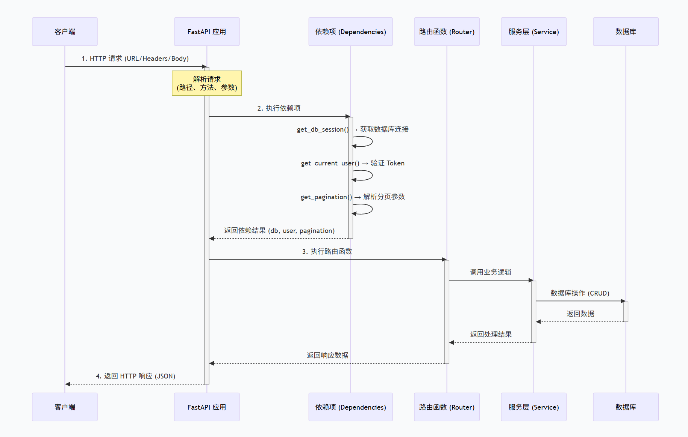

# Depends

## 📚 FastAPI 依赖注入（Dependencies）完全讲解

依赖注入是 FastAPI 的核心特性之一，也是实现**代码解耦**、**可测试性**和**可复用性**的关键。

🎯 什么是依赖注入？

**依赖注入（Dependency Injection, DI）** 是一种设计模式，指一个对象所需的依赖（如服务、配置、数据库连接等）不是由自身创建，而是由外部传入。

**简单类比**

```text
🏪 不用依赖注入：
厨师自己种菜、自己养猪、自己做饭（耦合度高）

✅ 使用依赖注入：
厨师从市场买菜（外部提供），专心做饭（解耦）
```

## 🔧 FastAPI 中的依赖注入

### 1. 基础语法

```python
from fastapi import Depends, FastAPI

app = FastAPI()

# ===== 定义依赖函数 =====
def get_query_params(q: str = None, skip: int = 0, limit: int = 10):
    """这是一个依赖函数，返回查询参数"""
    return {"q": q, "skip": skip, "limit": limit}

# ===== 使用依赖 =====
@app.get("/items")
async def read_items(params: dict = Depends(get_query_params)):
    """使用 Depends() 注入依赖"""
    return params

# 访问: /items?q=test&skip=5&limit=20
# 返回: {"q": "test", "skip": 5, "limit": 20}
```


### 2. 依赖的类型

#### ① 函数依赖（最常见）

python

```python
# app/core/deps.py
from fastapi import Depends, Header, HTTPException

def get_current_user(authorization: str = Header(...)):
    """验证 Token 并返回用户信息"""
    # 验证逻辑...
    return {"id": 1, "email": "user@example.com"}

@app.get("/users/me")
async def get_profile(user: dict = Depends(get_current_user)):
    return user
```


#### ② 类依赖


```python
from fastapi import Depends

class AuthService:
    def __init__(self, secret_key: str):
        self.secret_key = secret_key
    
    def verify_token(self, token: str):
        # 验证逻辑
        return True

# ===== 依赖注入 =====
def get_auth_service():
    return AuthService(secret_key="my-secret")

@app.post("/verify")
async def verify_token(
    token: str,
    auth_service: AuthService = Depends(get_auth_service)
):
    return {"valid": auth_service.verify_token(token)}
```


#### ③ 异步依赖


```python
async def get_db_session():
    """异步获取数据库连接"""
    db = await connect_to_database()
    try:
        yield db
    finally:
        await db.close()

@app.get("/users")
async def get_users(db = Depends(get_db_session)):
    return await db.query("SELECT * FROM users")
```


### 3. 依赖的层级

依赖可以**嵌套**，形成依赖链：


```python
# ===== 第一层依赖 =====
def get_db():
    """获取数据库连接"""
    return {"connection": "database"}

# ===== 第二层依赖（依赖第一层） =====
def get_user_repository(db: dict = Depends(get_db)):
    """获取用户仓储（依赖数据库）"""
    return {"repo": "user_repo", "db": db}

# ===== 第三层依赖（依赖第二层） =====
def get_user_service(repo: dict = Depends(get_user_repository)):
    """获取用户服务（依赖用户仓储）"""
    return {"service": "user_service", "repo": repo}

# ===== 路由中只注入最外层 =====
@app.get("/users/{user_id}")
async def get_user(
    user_id: int,
    service: dict = Depends(get_user_service)  # 自动解析所有嵌套依赖
):
    return service
```


**依赖链**：


```
get_user_service
    └── get_user_repository
        └── get_db
```


## 🚀 实际项目中的常见依赖

### 1. 数据库会话依赖


```python
# app/core/deps.py
from tortoise import Tortoise

async def get_db_session():
    """获取数据库连接（每个请求独立）"""
    conn = Tortoise.get_connection("default")
    try:
        yield conn
    finally:
        # 连接会自动释放
        pass

# 使用
@app.get("/items")
async def get_items(db = Depends(get_db_session)):
    return await db.execute("SELECT * FROM items")
```


### 2. 当前用户依赖（JWT 认证）


```python
# app/core/deps.py
from fastapi import Depends, Header, HTTPException, status
from typing import Annotated
from app.utils import jwt_util
from app.models.user import User

async def get_current_user(
    authorization: Annotated[str, Header()]
) -> User:
    """
    验证 JWT 并返回当前用户
    这是 FastAPI 项目中最常用的依赖
    """
    # 解析 Token
    token = authorization.split(" ")[1]
    
    # 验证 Token
    payload = jwt_util.verify_token(token)
    
    # 获取用户
    user = await User.get(id=payload["sub"])
    return user

async def get_current_active_user(
    current_user: User = Depends(get_current_user)
) -> User:
    """获取当前活跃用户（未删除、已激活）"""
    if current_user.is_deleted:
        raise HTTPException(403, "用户已被删除")
    if not current_user.is_active:
        raise HTTPException(403, "账号已被禁用")
    return current_user

async def get_current_admin_user(
    current_user: User = Depends(get_current_active_user)
) -> User:
    """获取当前管理员用户"""
    if current_user.role != "admin":
        raise HTTPException(403, "需要管理员权限")
    return current_user
```


**使用场景**：


```python
# app/routers/users.py
from fastapi import APIRouter, Depends
from app.core.deps import get_current_user, get_current_active_user, get_current_admin_user

router = APIRouter(prefix="/users", tags=["用户"])

@router.get("/me")
async def get_me(
    current_user = Depends(get_current_user)  # 只需要登录即可
):
    return current_user

@router.get("/profile")
async def get_profile(
    current_user = Depends(get_current_active_user)  # 需要激活的用户
):
    return current_user

@router.delete("/users/{user_id}")
async def admin_delete_user(
    user_id: int,
    current_user = Depends(get_current_admin_user)  # 需要管理员权限
):
    return {"message": f"用户 {user_id} 已删除"}
```


### 3. 分页参数依赖


```python
# app/core/deps.py
from typing import Optional
from fastapi import Query

def get_pagination(
    page: int = Query(1, ge=1, description="页码"),
    size: int = Query(10, ge=1, le=100, description="每页数量")
):
    """分页参数依赖"""
    return {"page": page, "size": size, "offset": (page - 1) * size}

# 使用
@app.get("/items")
async def get_items(
    pagination: dict = Depends(get_pagination)
):
    items = await Item.filter().offset(pagination["offset"]).limit(pagination["size"])
    return {
        "items": items,
        "page": pagination["page"],
        "size": pagination["size"]
    }
```


### 4. 服务依赖（业务层）


```python
# app/core/deps.py
from app.services.auth_service import AuthService
from app.services.user_service import UserService
from app.services.post_service import PostService

def get_auth_service() -> AuthService:
    """获取认证服务"""
    return AuthService()

def get_user_service() -> UserService:
    """获取用户服务"""
    return UserService()

def get_post_service() -> PostService:
    """获取文章服务"""
    return PostService()

# 使用
@router.post("/register")
async def register(
    user_data: UserCreate,
    auth_service = Depends(get_auth_service)
):
    return await auth_service.register(user_data)
```


### 5. 多个依赖组合


```python
# app/core/deps.py
from typing import Annotated

def get_settings():
    """获取配置"""
    return settings

def get_cache():
    """获取缓存客户端"""
    return redis_client

def get_notification_service(
    settings = Depends(get_settings),
    cache = Depends(get_cache)
):
    """通知服务依赖配置和缓存"""
    return NotificationService(settings, cache)

# 使用
@router.post("/send-notification")
async def send_notification(
    notification_service = Depends(get_notification_service)
):
    await notification_service.send()
```


------

## 📊 依赖注入的常见模式

### 模式一：简单依赖（单层）


```python
def get_token(token: str = Header(...)):
    return token

@app.get("/items")
async def get_items(token: str = Depends(get_token)):
    return {"token": token}
```


### 模式二：链式依赖（多层）


```python
def get_db():
    return db

def get_repo(db = Depends(get_db)):
    return Repository(db)

def get_service(repo = Depends(get_repo)):
    return Service(repo)

@app.get("/items")
async def get_items(service = Depends(get_service)):
    return await service.get_items()
```


### 模式三：工厂模式


```python
def get_service_with_config(config_type: str):
    def _get_service():
        if config_type == "dev":
            return DevService()
        else:
            return ProdService()
    return _get_service

@app.get("/items")
async def get_items(
    service = Depends(get_service_with_config("dev"))
):
    return await service.get_items()
```


### 模式四：请求级缓存


```python
from functools import lru_cache

def get_settings():
    """配置单例（整个应用生命周期）"""
    return Settings()

@lru_cache()
def get_settings_cached():
    """缓存配置"""
    return Settings()
```


------

## 🎯 依赖注入 vs 全局变量

| 对比项           | 依赖注入    | 全局变量    |
| :--------------- | :---------- | :---------- |
| **解耦**         | ✅ 高        | ❌ 低        |
| **可测试性**     | ✅ 容易 Mock | ❌ 难以 Mock |
| **代码复用**     | ✅ 高        | ❌ 低        |
| **生命周期控制** | ✅ 灵活      | ❌ 固定      |
| **依赖可见性**   | ✅ 明确      | ❌ 隐式      |
| **推荐度**       | ⭐⭐⭐⭐⭐       | ⭐⭐          |

------

## 💡 最佳实践总结


```python
# ✅ 好的实践：使用依赖注入
@router.get("/items")
async def get_items(
    db: Database = Depends(get_db),
    current_user: User = Depends(get_current_user),
    pagination: dict = Depends(get_pagination),
    service: ItemService = Depends(get_item_service)
):
    return await service.get_items(db, current_user, pagination)

# ❌ 不好的实践：使用全局变量
DB = connect_to_db()
CURRENT_USER = None

@router.get("/items")
async def get_items():
    # 全局变量难以测试和维护
    return await DB.query(...)
```


------

## 📋 依赖注入要点

| 要点                    | 说明                            |
| :---------------------- | :------------------------------ |
| **使用 `Depends()`**    | 声明依赖关系                    |
| **函数可以是同步/异步** | `def` 或 `async def` 都可以     |
| **依赖可以嵌套**        | 支持多层依赖链                  |
| **自动缓存**            | 同一请求中相同依赖只会调用一次  |
| **类型提示**            | 建议使用 `Annotated` 提高可读性 |


```
# 推荐写法
from typing import Annotated

@router.get("/items")
async def get_items(
    user: Annotated[User, Depends(get_current_user)],
    service: Annotated[ItemService, Depends(get_item_service)]
):
    return await service.get_items(user)
```


依赖注入是 FastAPI 的**灵魂**，用好它能让你的代码更清晰、更易测试、更易维护！🚀

## 实例

```python
from fastapi import APIRouter,Depends

router = APIRouter()

def level_1():
    print("level 1")
    return 10

def level_2a(t2a:int = Depends(level_1)):
    print("level 2a")
    return 20+t2a #20+10=30

def level_2b(t2b:int=Depends(level_1)):
    print("level 2b")
    return 40+t2b #40+10=50

def level_3(l2b:int =Depends(level_2b),l2a:int=Depends(level_2a))->int:
    print("level 3")
    return l2a+l2b #80

def query_depends(user:str,token:str):
    data={
        'user':user,
        'token':token
    }
    return data

@router.get('/deps')
async def level3(total:int=Depends(level_3),common:str=Depends(query_depends)):
    print("total")
    data = {
        'total':total,
        'common':common
    }
    return data
```




## 📚参考

1. [依赖项](https://fastapi.tiangolo.com/zh/tutorial/dependencies/)