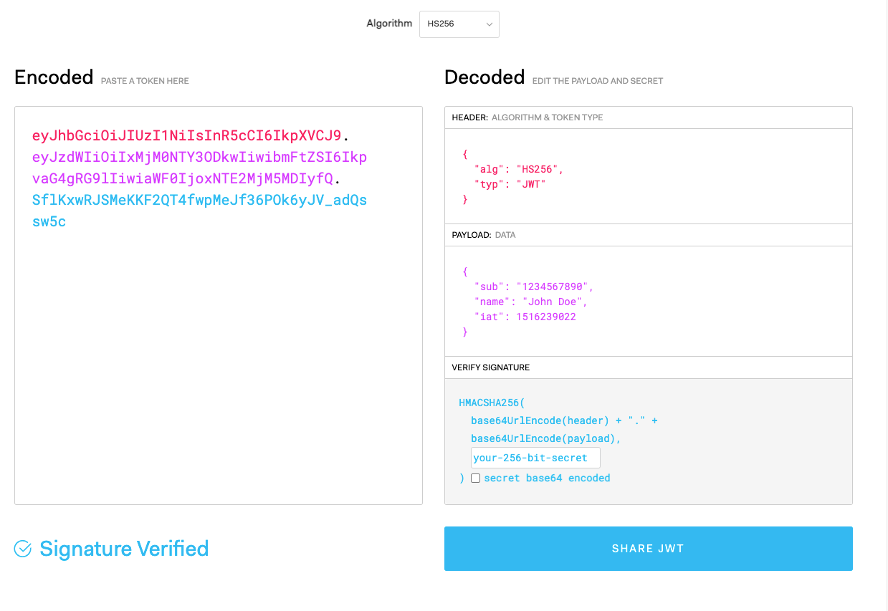

<!-- @include: @article-header.snippet.md -->

## JWT 是什么？

JWT（JSON Web Token）是 [RFC 7519](https://datatracker.ietf.org/doc/html/rfc7519) 定义的一种紧凑、URL 安全的声明表示格式。登录成功后，服务端可以把用户标识、权限范围和过期时间等声明写入 JWT；客户端在后续请求中携带它，服务端验证签名和相关声明后再决定是否放行。

JWT 可以承载鉴权所需的声明，因此服务端不一定要像传统 Session 方案那样保存会话状态。不过，撤销令牌、权限变更和主动下线等需求仍可能需要服务端状态，不能仅凭“使用 JWT”就认定系统完全无状态。

JWT 的 Header 和 Payload 只是经过 Base64Url 编码，拿到令牌的人都可以解码，不能把密码、身份证号等敏感信息写入 Payload。签名用于校验内容是否被篡改，并不负责加密内容。

如果客户端把 JWT 作为 Bearer Token 显式放入 `Authorization` Header，浏览器不会像 Cookie 那样自动附带它，因此可以降低传统 CSRF 风险。不过，这取决于凭据的传输和存储方式，而不是 JWT 格式本身；如果把 JWT 放在 Cookie 中，仍然需要 CSRF 防护。

[JWT 优缺点分析](./advantages-and-disadvantages-of-jwt.md)详细介绍了使用 JWT 做身份认证的优势和限制。

下面是 [RFC 7519](https://datatracker.ietf.org/doc/html/rfc7519) 对 JWT 的定义。

> JSON Web Token (JWT) is a compact, URL-safe means of representing claims to be transferred between two parties. The claims in a JWT are encoded as a JSON object that is used as the payload of a JSON Web Signature (JWS) structure or as the plaintext of a JSON Web Encryption (JWE) structure, enabling the claims to be digitally signed or integrity protected with a Message Authentication Code (MAC) and/or encrypted. ——[JSON Web Token (JWT)](https://datatracker.ietf.org/doc/html/rfc7519)

## JWT 由哪些部分组成？


JWT 通常由三个使用 `.` 分隔的 Base64Url 编码部分组成：

- **Header（头部）**：描述 JWT 的元数据，包含令牌类型和签名算法。Header 被 Base64Url 编码后成为 JWT 的第一部分。
- **Payload（载荷）**：存放需要传递的声明（Claims），如 `sub`（subject，主题）、`jti`（JWT ID）。Payload 被 Base64Url 编码后成为 JWT 的第二部分。
- **Signature（签名）**：根据编码后的 Header、Payload、签名算法和签名密钥计算。HS256 使用共享密钥，RS256、ES256 等非对称算法使用私钥签名、公钥验证。

JWT 通常是这样的：`xxxxx.yyyyy.zzzzz`。

示例：

```plain
eyJhbGciOiJIUzI1NiIsInR5cCI6IkpXVCJ9.
eyJzdWIiOiIxMjM0NTY3ODkwIiwibmFtZSI6IkpvaG4gRG9lIiwiaWF0IjoxNTE2MjM5MDIyfQ.
SflKxwRJSMeKKF2QT4fwpMeJf36POk6yJV_adQssw5c
```

你可以在 [jwt.io](https://jwt.io/) 对示例 JWT 进行解码，解码后可以看到 Header、Payload、Signature 这三部分。生产环境中的真实令牌可能包含用户标识和权限信息，不要复制到第三方在线工具中。

Header 和 Payload 都是 JSON 数据，Signature 则由编码后的 Header、Payload 和签名密钥计算得到。



### JWT 解析和 JWT 验证有什么区别？

JWT 解析只会对 Header 和 Payload 做 Base64Url 解码，不需要密钥。任何拿到令牌的人都能完成解析，因此解析结果不能证明令牌可信。

JWT 验证会使用指定算法和密钥校验 Signature，还应检查 `exp`、`nbf`、`iss`、`aud` 等声明。只有签名和业务要求的声明全部通过校验，服务端才能信任令牌中的身份与权限信息。

### Header

Header 通常由两部分组成：

- `typ`（Type）：令牌类型，也就是 JWT。
- `alg`（Algorithm）：签名算法，比如 HS256。

示例：

```json
{
  "alg": "HS256",
  "typ": "JWT"
}
```

JSON 形式的 Header 经 Base64Url 编码后成为 JWT 的第一部分。

### Payload

Payload 也是 JSON 数据，其中包含 Claims（声明）。

Claims 分为三种类型：

- **Registered Claims（注册声明）**：预定义的一些声明，建议使用，但不是强制性的。
- **Public Claims（公有声明）**：JWT 签发方可以自定义的声明，但是为了避免冲突，应该在 [IANA JSON Web Token Registry](https://www.iana.org/assignments/jwt/jwt.xhtml) 中定义它们。
- **Private Claims（私有声明）**：JWT 签发方因为项目需要而自定义的声明，更符合实际项目场景使用。

下面是一些常见的注册声明：

- `iss`（issuer）：JWT 签发方。
- `iat`（issued at time）：JWT 签发时间。
- `sub`（subject）：JWT 主题。
- `aud`（audience）：JWT 接收方。
- `exp`（expiration time）：JWT 的过期时间。
- `nbf`（not before time）：JWT 生效时间，早于该定义的时间的 JWT 不能被接受处理。
- `jti`（JWT ID）：JWT 唯一标识。

示例：

```json
{
  "uid": "ff1212f5-d8d1-4496-bf41-d2dda73de19a",
  "sub": "1234567890",
  "name": "John Doe",
  "exp": 15323232,
  "iat": 1516239022,
  "scope": ["admin", "user"]
}
```

Payload 部分默认是不加密的，**一定不要将隐私信息存放在 Payload 当中！！！**

JSON 形式的 Payload 经 Base64Url 编码后成为 JWT 的第二部分。

### Signature

Signature 部分是对前两部分的签名，作用是防止 JWT（主要是 payload） 被篡改。

这个签名的生成需要用到：

- Header + Payload。
- 存放在服务端的签名密钥。使用非对称算法时，签名私钥不能泄露。
- 签名算法。

签名的计算公式如下：

```plain
HMACSHA256(
  base64UrlEncode(header) + "." +
  base64UrlEncode(payload),
  secret)
```

算出签名以后，把 Header、Payload、Signature 三个部分拼成一个字符串，每个部分之间用“点”（`.`）分隔，这个字符串就是 JWT。

## 如何基于 JWT 进行身份验证？

在基于 JWT 进行身份验证的应用程序中，服务器通过 Payload、Header 和密钥创建 JWT 并将 JWT 发送给客户端。客户端需要根据应用形态和威胁模型安全地保存令牌，以后发出的请求会携带这个令牌。


简化后的步骤如下：

1. 用户向服务器发送用户名、密码以及验证码用于登陆系统；
2. 如果用户用户名、密码以及验证码校验正确的话，服务端会返回已经签名的 Token，也就是 JWT；
3. 客户端收到 Token 后安全保存；浏览器应用可以使用 BFF 把令牌保留在服务端，或者根据场景使用受保护的 Cookie；
4. 用户以后每次向后端发请求都在 Header 中带上这个 JWT ；
5. 服务端检查 JWT 并从中获取用户相关信息。

两点建议：

1. 不要默认把 JWT 存放在 `localStorage` 或 `sessionStorage` 中。同源页面中的任意恶意脚本都能读取 Web Storage，一处 XSS 漏洞就可能泄露令牌。使用 Cookie 时，应设置 `HttpOnly`、`Secure` 和合适的 `SameSite` 属性，并同时做好 CSRF 防护。
2. 非 Cookie 方案携带 JWT 的常见做法是将其放在 HTTP Header 的 `Authorization` 字段中（`Authorization: Bearer Token`）。

**[spring-security-jwt-guide](https://github.com/Snailclimb/spring-security-jwt-guide)** 就是一个基于 JWT 来做身份认证的简单案例，感兴趣的可以看看。

## 如何防止 JWT 被篡改？

有了正确校验的签名之后，即使 JWT 被泄露或者截获，攻击者也无法在不知道签名密钥的情况下修改 Header 或 Payload 并生成有效签名。但签名不提供保密性，也不能阻止攻击者直接重放被盗的有效 JWT。

这是为什么呢？因为服务端拿到 JWT 之后，会解析出其中包含的 Header、Payload 以及 Signature 。服务端会根据 Header、Payload、密钥再次生成一个 Signature。拿新生成的 Signature 和 JWT 中的 Signature 作对比，如果一样就说明 Header 和 Payload 没有被修改。

不过，如果服务端的密钥也被泄露，攻击者就可以修改 Header 和 Payload，再重新生成一个有效的 Signature。

签名密钥必须妥善保管，并建立轮换和吊销机制。

## 如何加强 JWT 的安全性？

1. 使用成熟的开源库，不要自己实现 JWT 加解密和校验逻辑。
2. 服务端固定允许的算法集合，不能直接信任 JWT Header 中的 `alg` 选择验证算法；HMAC 密钥要有足够的随机性和长度。
3. 验证所有与当前应用有关的声明，包括 `iss`、`aud`、`exp` 和 `nbf`，并为允许的时钟偏差设置明确上限。
4. 对 ID Token、Access Token 等不同用途的 JWT 使用显式 `typ` 和互斥的校验规则，防止一种令牌被替换到另一种场景。
5. 一定不要将隐私信息存放在未加密的 Payload 当中，也不能把收到但尚未验证的 Claim 当作可信输入。
6. 根据客户端类型选择安全的令牌存储方式，限制令牌有效期、权限范围和接收方；高风险场景还要考虑撤销、重放检测或发送者约束。
7. 密钥必须妥善保管并支持轮换。更完整的安全要求可以参考 [RFC 8725：JSON Web Token Best Current Practices](https://www.rfc-editor.org/rfc/rfc8725.html)。

<!-- @include: @article-footer.snippet.md -->

---
title: JWT 身份认证优缺点分析
description: JWT身份认证优缺点深度分析，讲解JWT无法主动失效、Token续期等问题及对应的解决方案。
category: 系统设计
tag:
  - 安全
head:
  - - meta
    - name: keywords
      content: JWT,Token认证,无状态认证,JWT缺点,刷新令牌,注销失效,安全风险,替代方案
---

校招面试中，遇到大部分的候选者认证登录这块用的都是 JWT。提问 JWT 的概念性问题以及使用 JWT 的原因，基本都能回答一些，但当问到 JWT 存在的一些问题和解决方案时，只有一小部分候选者回答的还可以。

JWT 不是银弹，也有很多缺陷，很多时候并不是最优的选择。这篇文章，我们一起探讨一下 JWT 身份认证的优缺点以及常见问题的解决办法，来看看为什么很多人不再推荐使用 JWT 了。

关于 JWT 的基本概念介绍请看我写的这篇文章： [JWT 基本概念详解](https://javaguide.cn/system-design/security/jwt-intro.html)。

## JWT 的优势

相比于 Session 认证的方式来说，使用 JWT 进行身份认证主要有下面 4 个优势。

### 无状态

JWT 自身包含了身份验证所需要的所有信息，因此，我们的服务器不需要存储 JWT 信息。这显然增加了系统的可用性和伸缩性，大大减轻了服务端的压力。

不过，也正是由于 JWT 的无状态，也导致了它最大的缺点：**不可控！**

就比如说，我们想要在 JWT 有效期内废弃一个 JWT 或者更改它的权限的话，并不会立即生效，通常需要等到有效期过后才可以。再比如说，当用户 Logout 的话，JWT 也还有效。除非，我们在后端增加额外的处理逻辑比如将失效的 JWT 存储起来，后端先验证 JWT 是否有效再进行处理。具体的解决办法，我们会在后面的内容中详细介绍到，这里只是简单提一下。

### 使用 Authorization Header 可降低传统 CSRF 风险

**CSRF（Cross Site Request Forgery）** 一般被翻译为 **跨站请求伪造**，属于网络攻击领域范围。相比于 SQL 脚本注入、XSS 等安全攻击方式，CSRF 的知名度并没有它们高。但是，它的确是我们开发系统时必须要考虑的安全隐患。就连业内技术标杆 Google 的产品 Gmail 也曾在 2007 年的时候爆出过 CSRF 漏洞，这给 Gmail 的用户造成了很大的损失。

**那么究竟什么是跨站请求伪造呢？** 简单来说就是用你的身份去做一些不好的事情（发送一些对你不友好的请求比如恶意转账）。

举个简单的例子：小壮登录了某网上银行，他来到了网上银行的帖子区，看到一个帖子下面有一个链接写着“科学理财，年盈利率过万”，小壮好奇的点开了这个链接，结果发现自己的账户少了 10000 元。这是这么回事呢？原来黑客在链接中藏了一个请求，这个请求直接利用小壮的身份给银行发送了一个转账请求，也就是通过你的 Cookie 向银行发出请求。

```html
<a href="http://www.mybank.com/Transfer?bankId=11&money=10000"
  >科学理财，年盈利率过万</a
>
```

传统 CSRF 攻击利用的是浏览器会自动附带身份凭据这一特性，最常见的凭据就是 Cookie 中的 `SessionID`。即使攻击者无法读取 `SessionID`，也可能诱导浏览器携带它向目标站点发出请求。

另外，并不是必须点击链接才可以达到攻击效果，很多时候，只要你打开了某个页面，CSRF 攻击就会发生。

```html

```

**那为什么使用 JWT 时经常说 CSRF 风险更低呢？**

如果客户端将 JWT 作为 Bearer Token，显式放入 HTTP `Authorization` Header，浏览器不会像 Cookie 那样自动把它附带到跨站请求中，因此可以降低这类传统 CSRF 风险。这里起作用的是凭据的传输方式，而不是 JWT 这种数据格式本身。

不过，不能因此默认把 JWT 存进 `localStorage`。同源页面中的任意恶意脚本都可以读取 Web Storage，一处 XSS 漏洞就可能导致 access token 或 refresh token 被直接窃取。浏览器应用需要结合威胁模型选择方案，例如使用 `HttpOnly`、`Secure`、合适 `SameSite` 属性的 Cookie，或者使用 Backend For Frontend（BFF）把令牌保留在服务端。

如果使用 Cookie 保存登录凭据，就要同时做好 CSRF 防护，例如 CSRF Token、`Origin`/`Referer` 校验和 `SameSite` Cookie。`SameSite` 通常应作为纵深防御，不能在所有部署中单独替代 CSRF Token。

防范 XSS 不能依赖一个通用的“可疑字符串过滤器”。更可靠的做法是在数据输出到 HTML、属性、JavaScript、CSS、URL 等不同上下文时分别进行正确编码；确实允许用户提交 HTML 时，使用持续更新的成熟 HTML 净化库；再通过 CSP 等机制提供纵深防御。

### 适合移动端应用

使用 Session 进行身份认证的话，需要保存一份信息在服务器端，而且这种方式会依赖到 Cookie（需要 Cookie 保存 `SessionId`），所以不适合移动端。

但是，使用 JWT 进行身份认证就不会存在这种问题，因为只要 JWT 可以被客户端存储就能够使用，而且 JWT 还可以跨语言使用。

> 为什么使用 Session 进行身份认证的话不适合移动端 ？
>
> 1. 状态管理: Session 基于服务器端的状态管理，而移动端应用通常是无状态的。移动设备的连接可能不稳定或中断，因此难以维护长期的会话状态。如果使用 Session 进行身份认证，移动应用需要频繁地与服务器进行会话维护，增加了网络开销和复杂性;
> 2. 兼容性: 移动端应用通常会面向多个平台，如 iOS、Android 和 Web。每个平台对于 Session 的管理和存储方式可能不同，可能导致跨平台兼容性的问题;
> 3. 安全性: 移动设备通常处于不受信任的网络环境，存在数据泄露和攻击的风险。将敏感的会话信息存储在移动设备上增加了被攻击的潜在风险。

### 单点登录友好

使用 Session 进行身份认证的话，实现单点登录，需要我们把用户的 Session 信息保存在一台电脑上，并且还会遇到常见的 Cookie 跨域的问题。但是，使用 JWT 进行认证的话， JWT 被保存在客户端，不会存在这些问题。

## JWT 身份认证常见问题及解决办法

### 注销登录等场景下 JWT 还有效

与之类似的具体相关场景有：

- 退出登录;
- 修改密码;
- 服务端修改了某个用户具有的权限或者角色；
- 用户的帐户被封禁/删除；
- 用户被服务端强制注销；
- 用户被踢下线；
- ……

这个问题不存在于 Session 认证方式中，因为在 Session 认证方式中，遇到这种情况的话服务端删除对应的 Session 记录即可。但是，使用 JWT 认证的方式就不好解决了。我们也说过了，JWT 一旦派发出去，如果后端不增加其他逻辑的话，它在失效之前都是有效的。

那我们如何解决这个问题呢？查阅了很多资料，我简单总结了下面 4 种方案：

**1、将 JWT 存入数据库**

将有效的 JWT 存入数据库中，更建议使用内存数据库比如 Redis。如果需要让某个 JWT 失效就直接从 Redis 中删除这个 JWT 即可。但是，这样会导致每次使用 JWT 都要先从 Redis 中查询 JWT 是否存在的步骤，而且违背了 JWT 的无状态原则。

**2、黑名单机制**

和上面的方式类似，使用内存数据库比如 Redis 维护一个黑名单，如果想让某个 JWT 失效的话就直接将这个 JWT 加入到 **黑名单** 即可。然后，每次使用 JWT 进行请求的话都会先判断这个 JWT 是否存在于黑名单中。

前两种方案的核心在于将有效的 JWT 存储起来或者将指定的 JWT 拉入黑名单。

虽然这两种方案都违背了 JWT 的无状态原则，但是一般实际项目中我们通常还是会使用这两种方案。

**3、修改密钥 (Secret)** :

我们为每个用户都创建一个专属密钥，如果我们想让某个 JWT 失效，我们直接修改对应用户的密钥即可。但是，这样相比于前两种引入内存数据库带来了危害更大：

- 如果服务是分布式的，则每次发出新的 JWT 时都必须在多台机器同步密钥。为此，你需要将密钥存储在数据库或其他外部服务中，这样和 Session 认证就没太大区别了。
- 如果用户同时在两个浏览器打开系统，或者在手机端也打开了系统，如果它从一个地方将账号退出，那么其他地方都要重新进行登录，这是不可取的。

**4、保持令牌的有效期限短并经常轮换**

很简单的一种方式。但是，会导致用户登录状态不会被持久记录，而且需要用户经常登录。

另外，对于修改密码后 JWT 还有效问题的解决还是比较容易的。说一种我觉得比较好的方式：**使用用户的密码的哈希值对 JWT 进行签名。因此，如果密码更改，则任何先前的令牌将自动无法验证。**

### JWT 的续签问题

JWT 有效期一般都建议设置的不太长，那么 JWT 过期后如何认证，如何实现动态刷新 JWT，避免用户经常需要重新登录？

我们先来看看在 Session 认证中一般的做法：**假如 Session 的有效期 30 分钟，如果 30 分钟内用户有访问，就把 Session 有效期延长 30 分钟。**

JWT 认证的话，我们应该如何解决续签问题呢？查阅了很多资料，我简单总结了下面 4 种方案：

**1、类似于 Session 认证中的做法（不推荐）**

这种方案满足于大部分场景。假设服务端给的 JWT 有效期设置为 30 分钟，服务端每次进行校验时，如果发现 JWT 的有效期马上快过期了，服务端就重新生成 JWT 给客户端。客户端每次请求都检查新旧 JWT，如果不一致，则更新本地的 JWT。这种做法的问题是仅仅在快过期的时候请求才会更新 JWT ，对客户端不是很友好。

**2、每次请求都返回新 JWT（不推荐）**

这种方案的思路很简单，但是，开销会比较大，尤其是在服务端要存储维护 JWT 的情况下。

**3、JWT 有效期设置到半夜（不推荐）**

这种方案是一种折衷的方案，保证了大部分用户白天可以正常登录，适用于对安全性要求不高的系统。

**4、使用短期访问令牌和长期刷新令牌（推荐）**

第一个是短期的 access token，例如半个小时后过期；另一个是生命周期更长的 refresh token，只用于获取新的 access token。两者不一定都要使用 JWT 格式。refresh token 权限高、存活时间长，是攻击者重点窃取的凭据，不能因为它使用频率低就认为“不容易泄露”。

客户端登录后，每次访问携带 access token。access token 过期后，客户端通过受保护的 refresh token 换取新的 access token。浏览器应用不应默认把 refresh token 放进 `localStorage`，可以通过 BFF 或受保护的 Cookie 降低令牌被脚本直接读取的风险。

这种方案的不足是：

- 需要客户端来配合；
- 用户注销、修改密码或发生其他安全事件时，需要撤销相应的刷新授权；
- 重新请求获取 JWT 的过程中会有短暂 JWT 不可用的情况（可以通过在客户端设置定时器，当 accessJWT 快过期的时候，提前去通过 refreshJWT 获取新的 accessJWT）;
- 对公共客户端，授权服务器需要使用刷新令牌轮换并检测旧令牌重放，或者使用发送者约束的刷新令牌。刷新令牌还应绑定客户端、授权范围和资源服务器，并设置闲置过期时间。

### JWT 体积太大

JWT 结构复杂（Header、Payload 和 Signature），包含了更多额外的信息，还需要进行 Base64Url 编码，这会使得 JWT 体积较大，增加了网络传输的开销。

JWT 组成:


JWT 示例：

```plain
eyJhbGciOiJIUzI1NiIsInR5cCI6IkpXVCJ9.
eyJzdWIiOiIxMjM0NTY3ODkwIiwibmFtZSI6IkpvaG4gRG9lIiwiaWF0IjoxNTE2MjM5MDIyfQ.
SflKxwRJSMeKKF2QT4fwpMeJf36POk6yJV_adQssw5c
```

解决办法：

- 尽量减少 JWT Payload（载荷）中的信息，只保留必要的用户和权限信息。
- 在传输 JWT 之前，使用压缩算法（如 GZIP）对 JWT 进行压缩以减少体积。
- 在某些情况下，使用传统的 Token 可能更合适。传统的 Token 通常只是一个唯一标识符，对应的信息（例如用户 ID、Token 过期时间、权限信息）存储在服务端，通常会通过 Redis 保存。

## 总结

JWT 其中一个很重要的优势是无状态，但实际上，我们想要在实际项目中合理使用 JWT 做认证登录的话，也还是需要保存 JWT 信息。

JWT 也不是银弹，也有很多缺陷，具体是选择 JWT 还是 Session 方案还是要看项目的具体需求。万万不可尬吹 JWT，而看不起其他身份认证方案。

另外，不用 JWT 直接使用普通的 Token(随机生成的 ID，不包含具体的信息) 结合 Redis 来做身份认证也是可以的。

## 参考

- RFC 9700 - Best Current Practice for OAuth 2.0 Security：<https://www.rfc-editor.org/rfc/rfc9700.html>
- OWASP Session Management Cheat Sheet：<https://cheatsheetseries.owasp.org/cheatsheets/Session_Management_Cheat_Sheet.html>
- OWASP Cross Site Scripting Prevention Cheat Sheet：<https://cheatsheetseries.owasp.org/cheatsheets/Cross_Site_Scripting_Prevention_Cheat_Sheet.html>
- JWT 超详细分析：<https://learnku.com/articles/17883>
- How to log out when using JWT：<https://medium.com/devgorilla/how-to-log-out-when-using-jwt-a8c7823e8a6>
- CSRF protection with JSON Web JWTs：<https://medium.com/@agungsantoso/csrf-protection-with-json-web-JWTs-83e0f2fcbcc>
- Invalidating JSON Web JWTs：<https://stackoverflow.com/questions/21978658/invalidating-json-web-JWTs>

<!-- @include: @article-footer.snippet.md -->